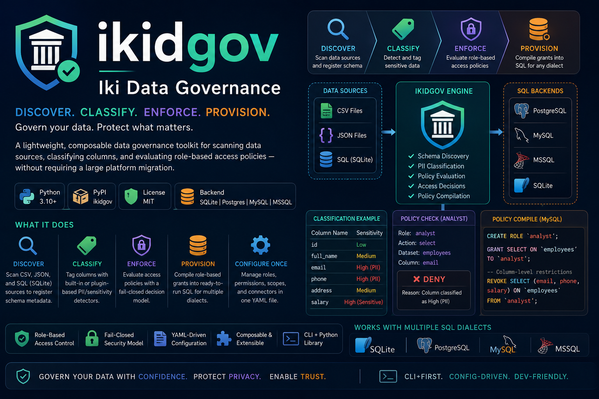

# ikidgov - Iki Data Goverance

ikidgov is a lightweight, composable data governance toolkit for scanning data sources,
classifying columns, and evaluating role-based access policies — without requiring a large
platform migration.




## What it does

ikidgov helps you:

- **Discover** — scan CSV, JSON, and SQL (SQLite) sources to register schema metadata
- **Classify** — tag columns with built-in or plugin-based PII/sensitivity detectors
- **Enforce** — evaluate access policies with a fail-closed decision model
- **Provision** — compile role-based grants into ready-to-run SQL for MySQL, PostgreSQL,
  MSSQL, or generic SQL dialects
- **Configure once** — keep roles, permissions, scopes, and connector defaults in a single
  YAML file, with environment-specific overrides (`dev` / `staging` / `prod`)

## Installation

### From PyPI

```bash
pip install ikidgov
```

This installs the `ikidgov` console command along with the importable `ikidgov` Python
package.

### From source (development install)

```bash
git clone <this repository>
cd ikidgov
python -m pip install -e ".[dev]"
```

### Optional: Docker Compose stack

Only needed if you want local Postgres/MySQL/MSSQL containers to experiment against — see
[Docker Compose stack](#docker-compose-stack-optional-unrelated-to-the-enterprise-setup-script)
below. It is unrelated to `examples/enterprise_setup.py`, which never touches Docker.

```bash
cp .env.example .env   # adjust values if needed; see "Secrets & credentials" below
docker compose up -d --wait
```

### Requirements

- Python 3.10 or newer
- PyYAML, SQLAlchemy, and the driver for whichever SQL backend(s) you target
  (`psycopg2-binary` for Postgres, `pymysql` for MySQL, `pyodbc` for MSSQL)
- Docker is entirely optional — it's only used by the standalone Docker Compose stack
  below, never by `examples/enterprise_setup.py`

## Quick start

```bash
# 1. Scan a file and register its schema
ikidgov scan --type csv --path customers.csv --owner jdoe

# 2. Scan a SQL table with the shared governance YAML and a PostgreSQL backend
ikidgov scan --type sql --path ./data/sqlite/registry.db --table employees --owner jdoe --backend postgres --config config/governance.yaml

# 3. Scan the same table with MySQL or MSSQL
ikidgov scan --type sql --path ./data/sqlite/registry.db --table employees --owner jdoe --backend mysql --config config/governance.yaml
ikidgov scan --type sql --path ./data/sqlite/registry.db --table employees --owner jdoe --backend mssql --config config/governance.yaml

# 2. Classify the columns
ikidgov classify --dataset-id 1

# 3. Check whether a role can access a column
ikidgov policy-check --actor-role analyst --action-type select --dataset-id 1 --column email

# 4. Compile policy output for a SQL dialect
ikidgov policy-compile --policy restrict_pii --table employees --dialect mysql --format text
```

Every subcommand accepts `--format json` (default) or `--format text` for output rendering.

## Configuration

The main configuration file is [config/governance.yaml](config/governance.yaml). It keeps
governance settings in one place:

- roles and their permissions
- role-scoped account credentials
- connector defaults (per source type: `csv`, `json`, `sql`)
- policy-related metadata

Example:

```yaml
roles:
  analyst:
    description: Consumes data within policy limits
    account:
      username: analyst
      password: "<set a strong password — do not commit real passwords>"
    permissions:
      - select
    scope: policy_restricted

connectors:
  csv:
    default_type: string
```

### Config resolution order

ikidgov looks for a config file in this order (first match wins):

1. An explicit path passed to `load_config(path)` / the tool's `--config` option, where
   applicable
2. `$IKIDGOV_CONFIG`, if set
3. `governance.<environment>.yaml` in the current working directory, if `$IKIDGOV_ENV` or
   `$APP_ENV` is set and the file exists
4. `governance.yaml` in the current working directory
5. `config/governance.<environment>.yaml` under the current working directory
6. The bundled `config/governance.yaml` shipped with the package

Environment-specific example files are included in [config](config):

- [config/governance.dev.yaml](config/governance.dev.yaml)
- [config/governance.staging.yaml](config/governance.staging.yaml)
- [config/governance.prod.yaml](config/governance.prod.yaml)

Try them with either the environment variable or the CLI flag:

```bash
IKIDGOV_ENV=dev ikidgov show-config
ikidgov --env staging show-config
ikidgov --env prod show-config
```

### Secrets & credentials

- **Never commit real passwords.** The `governance.*.yaml` files under `config/` are
  _examples_ — replace every `password` field with a real secret sourced from your
  environment or secrets manager before using a profile outside local development.
- If a role's `account.password` is left unset, `policy-compile` will refuse to generate
  `CREATE USER` / `CREATE LOGIN` SQL for that role rather than falling back to a default —
  you must set a password explicitly for any role that needs a provisioned database account.
- `.env` is for local, disposable Docker Compose credentials only. Copy `.env.example` to
  `.env` and keep the real `.env` out of version control (see `.gitignore`).

## Docker Compose stack (optional, unrelated to the enterprise setup script)

The repository also includes an optional Docker Compose stack that spins up local
PostgreSQL, MySQL, and MSSQL containers for ad-hoc experimentation.

```bash
cp .env.example .env
docker compose up -d --wait
```

This is entirely optional and is **not** used by `examples/enterprise_setup.py` — that
script talks to databases exclusively through connection strings (see below), so it works
identically against this local stack, a cloud-hosted database, or nothing but SQLite. Docker
is never started, stopped, or otherwise managed by the script.

> Note: the bundled `scan` CLI command currently discovers schema from **SQLite** files for
> the `sql` source type (`--type sql --path <file> --table <name>`). It is not (yet) a
> multi-dialect `scan` target — the multi-dialect path is `policy-compile` /
> `enterprise_setup.py` provisioning, described below.

## Core modules

| Module                  | Responsibility                                                       |
| ----------------------- | -------------------------------------------------------------------- |
| `metadata_registry`     | Stores datasets, columns, owners, tags, and sensitivity labels       |
| `connectors`            | CSV, JSON, and SQL (SQLite) schema-discovery helpers                 |
| `classification_engine` | Applies built-in or plugin detectors to tag column sensitivity       |
| `policy_engine`         | Evaluates access decisions and compiles role grants into dialect SQL |
| `access_control`        | Role-based CRUD for roles, permissions, and access entries           |

Modules are registered as `4p.modules` entry points (see `pyproject.toml`) and detectors as
`4p.detectors` entry points, so both are discoverable and swappable without changing core code.

## Enterprise setup script (`examples/enterprise_setup.py`)

[`examples/enterprise_setup.py`](examples/enterprise_setup.py) is a runnable walkthrough of
the whole governance model: it provisions example tables, prints a role/account overview,
runs the access-control CRUD and policy-check demos, and compiles + applies per-role database
grants for SQLite, PostgreSQL, MySQL, and MSSQL.

**It talks to databases through connection strings only.** There is no Docker dependency and
no container management anywhere in the script — bring your own running database (a local
install, a managed/cloud instance, or a container you started yourself), or just use the
zero-setup SQLite default.

### 1. Install the package

```bash
git clone <this repository>
cd ikidgov
python -m pip install -e ".[dev]"
```

This pulls in SQLAlchemy plus the drivers for every supported backend (`psycopg2-binary`,
`pymysql`, `pyodbc`). MSSQL also requires the [Microsoft ODBC Driver 18 for SQL
Server](https://learn.microsoft.com/sql/connect/odbc/linux-mac/installing-the-microsoft-odbc-driver-for-sql-server)
to be installed on your machine.

### 2. Try it with zero setup (SQLite)

```bash
python examples/enterprise_setup.py --dry-run --skip-demo   # preview only, no writes
python examples/enterprise_setup.py                         # apply — writes ./data/sqlite/registry.db
python examples/enterprise_setup.py --teardown               # drop the example tables
```

### 3. Point it at a real PostgreSQL / MySQL / MSSQL server

Provide a connection string using any one of these, in priority order:

| Priority | Method                                                                   | Scope                       |
| -------- | ------------------------------------------------------------------------ | --------------------------- |
| 1        | `--connection-string "<url>"`                                            | single `--dialect` run only |
| 2        | Env var: `IKIGOV_POSTGRES_URL` / `IKIGOV_MYSQL_URL` / `IKIGOV_MSSQL_URL` | that dialect                |
| 3        | `<dialect>.connection_string` (or `.dsn`) in your governance YAML        | that dialect                |
| 4        | _(SQLite only)_ a local file, default `./data/sqlite/registry.db`        | sqlite                      |

```bash
# via environment variable
export IKIGOV_POSTGRES_URL="postgresql://user:pw@host:5432/db"
python examples/enterprise_setup.py --dialect postgresql

export IKIGOV_MYSQL_URL="mysql+pymysql://user:pw@host:3306/db"
python examples/enterprise_setup.py --dialect mysql

export IKIGOV_MSSQL_URL="mssql+pyodbc://user:pw@host:1433/db?driver=ODBC+Driver+18+for+SQL+Server"
python examples/enterprise_setup.py --dialect mssql

# or pass the connection string directly for a single dialect
python examples/enterprise_setup.py --dialect postgresql \
  --connection-string "postgresql://user:pw@host:5432/db"
```

If nothing is configured for a server-backed dialect, the script exits immediately with an
actionable error — it never falls back to a guessed or default credential.

Run every dialect in one pass (each still resolves its own connection independently):

```bash
python examples/enterprise_setup.py --dialect all --dry-run   # preview across all four
python examples/enterprise_setup.py --dialect all             # apply to all four
python examples/enterprise_setup.py --dialect all --teardown  # reset all four
```

### 4. Wire in per-role database accounts (optional)

For every role in your governance config that has `account.password` (or
`account.password_env`) set, the script compiles and applies `CREATE USER` / `CREATE ROLE` /
`GRANT` statements scoped to that role's permissions. Roles without a configured password are
skipped with a message — never given a shared or guessed password.

```yaml
roles:
  analyst:
    account:
      username: analyst
      password_env: ANALYST_DB_PASSWORD # preferred over a plaintext `password:` field
    permissions:
      - select
    scope: policy_restricted
```

### 5. Use a specific governance profile

```bash
python examples/enterprise_setup.py --dialect postgresql --config config/governance.yaml
IKIGOV_ENV=dev python examples/enterprise_setup.py --dry-run
```

### Useful flags

| Flag                                            | Effect                                                       |
| ----------------------------------------------- | ------------------------------------------------------------ |
| `--dialect {sqlite,postgresql,mysql,mssql,all}` | Which backend(s) to target (default `sqlite`)                |
| `--connection-string`                           | Explicit connection string (single dialect only)             |
| `--sqlite-path`                                 | Override the SQLite file location                            |
| `--config`                                      | Path to a specific governance YAML                           |
| `--dry-run`                                     | Print what would run without executing anything              |
| `--teardown`                                    | Drop the example tables/schemas before re-applying setup SQL |
| `--skip-demo`                                   | Skip the access-control CRUD and policy-check demos          |

See [examples/GUIDE.md](examples/GUIDE.md) for the full walkthrough, including the
role/account reference and config-file format.

## Testing

Install the dev extras and run the test suite locally:

```bash
python -m pip install -e ".[dev]"
pytest
```

The suite covers CLI smoke tests, config resolution/overrides, access-control CRUD, policy
evaluation, module isolation, and the example provisioning scripts.

## Project layout

```
src/ikidgov/
  cli/            argparse-based CLI and subcommands
  config_loader.py   governance YAML resolution
  connectors/     CSV / JSON / SQL schema discovery
  core/           shared base classes (Module, Connector, Detector, Decision, CRUD base)
  detectors/      built-in and plugin PII detectors
  modules/        access_control, classification_engine, metadata_registry, policy_engine
  policies/       policy definitions (YAML), e.g. restrict_pii.yaml
config/           governance.yaml + per-environment overrides
examples/         enterprise_setup.py (connection-string based, no Docker) and seed SQL
init/             one-shot DB seed scripts used by the optional docker-compose.yml stack
tests/            pytest suite
```

## License

This project is licensed under the MIT License. See [LICENSE](LICENSE).
